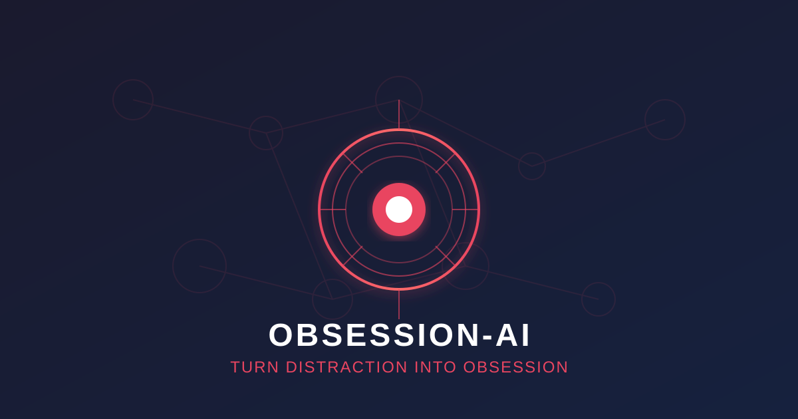
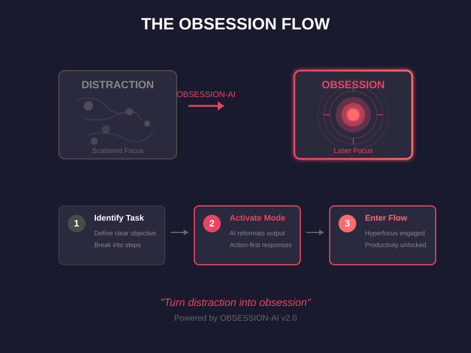
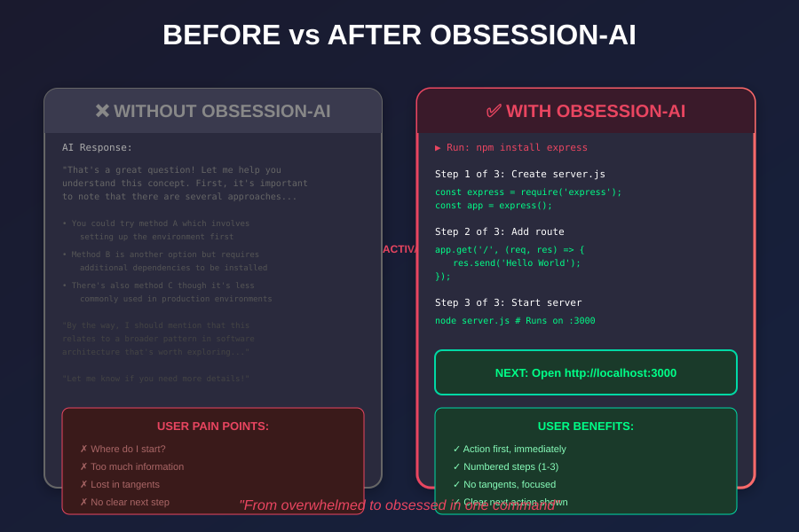
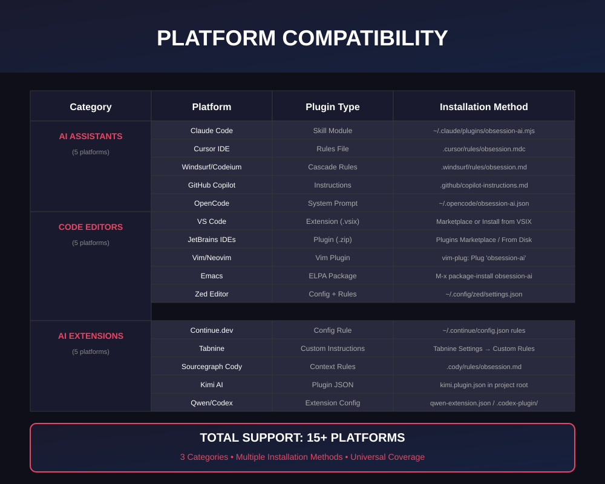

<p align="center">
  
</p>
<p align="center">
  <strong align="center">Turn distraction into obsession. Hack your hyperfocus.</strong>
</p>
<p align="center">
  <a href="LICENSE"></a>
  <a href="https://www.npmjs.com/package/obsession-ai"></a>
  <a href="https://github.com/ayghri/obsession-ai/actions"></a>
</p>

<p align="center">
  <strong title="English" aria-label="English">🇬🇧</strong> ·
  <a href=".github/readme/README.zh-CN.md" title="简体中文" aria-label="简体中文">🇨🇳</a> ·
  <a href=".github/readme/README.pt-BR.md" title="Português (Brasil)" aria-label="Português (Brasil)">🇧🇷</a> ·
  <a href=".github/readme/README.ja.md" title="日本語" aria-label="日本語">🇯🇵</a> ·
  <a href=".github/readme/README.vi.md" title="Tiếng Việt" aria-label="Tiếng Việt">🇻🇳</a> ·
  <a href=".github/readme/README.ko.md" title="한국어" aria-label="한국어">🇰🇷</a> ·
  <a href=".github/readme/README.th.md" title="ภาษาไทย" aria-label="ภาษาไทย">🇹🇭</a>
</p>


## 🎯 What is OBSESSION-AI?

**OBSESSION-AI** transforms your AI coding assistant from a distraction machine into a hyperfocus engine. It reformats every response to be action-first, numbered, and tangent-free—keeping you in flow state and shipping code faster.

<p align="center">
  
</p>

## ⚡ Quick Install

```bash
# Claude Code
claude plugin marketplace add ayghri/obsession-ai

# npm package
npm install -g obsession-ai

# Or copy the skill manually
cp -r skills/obsession-ai ~/.claude/plugins/
```

🔗 [Full installation guide for all platforms →](INSTALL.md)

---

## 📊 Before vs After

<p align="center">
  
</p>

### Real Example

<table>
<tr>
<td width="50%">

#### ❌ Without OBSESSION-AI

> Great question! Let me think about this. Your auth flow has a few moving pieces: the middleware, the token verification, and the cookie handling. Looking at `src/auth.ts`, the `verifyToken` function (around lines 42-58) seems to be using an older `jsonwebtoken` API. One approach would be to update the package and rewrite that function. After making the change, you'd want to run the auth tests to confirm nothing breaks. By the way, you might also want to look at your dependency versions overall. Hope this helps! Let me know if you want to dig deeper.

</td>

<td width="50%">

#### ✅ With OBSESSION-AI

> Run `npm install jsonwebtoken@latest`, then edit `src/auth.ts:42`.
>
> 1. Open `src/auth.ts`
> 2. Replace `verifyToken` (lines 42–58) with the snippet below
> 3. Run `npm test -- auth.spec.ts`
>
> **Next:** Paste the first failing line if any test fails.

</td>
</tr>
</table>

---

## 🔥 The 10 Rules of Obsession

OBSESSION-AI follows these rules to keep you in hyperfocus:

1. **Lead with the next action** - Command/path/snippet first
2. **Number multi-step tasks** - One action per step
3. **End with concrete next action** - Under 2 minutes
4. **Suppress tangents** - Finish current issue first
5. **Restate state every turn** - "Step 3 of 5 done"
6. **Specific time estimates** - "15 minutes" not "a bit"
7. **Make wins visible** - Show what works now
8. **Matter-of-fact errors** - State cause and fix
9. **Cap lists at 5 items** - Split "do now" vs "later"
10. **No preamble/recap/closers** - Start with answer

---

## 🌐 Platform Support

OBSESSION-AI works with **15+ platforms** across 3 categories:

<p align="center">
  
</p>

### AI Assistants
| Platform | Type | Installation |
|----------|------|--------------|
| Claude Code | Skill Module | `~/.claude/plugins/obsession-ai.mjs` |
| Cursor IDE | Rules File | `.cursor/rules/obsession.mdc` |
| Windsurf/Codeium | Cascade Rules | `.windsurf/rules/obsession.md` |
| GitHub Copilot | Instructions | `.github/copilot-instructions.md` |
| OpenCode | System Prompt | `~/.opencode/obsession-ai.json` |

### Code Editors
| Platform | Type | Installation |
|----------|------|--------------|
| VS Code | Extension (.vsix) | Marketplace or Install from VSIX |
| JetBrains IDEs | Plugin (.zip) | Plugins Marketplace / From Disk |
| Vim/Neovim | Vim Plugin | `vim-plug: Plug 'obsession-ai'` |
| Emacs | ELPA Package | `M-x package-install obsession-ai` |
| Zed Editor | Config + Rules | `~/.config/zed/settings.json` |

### AI Extensions
| Platform | Type | Installation |
|----------|------|--------------|
| Continue.dev | Config Rule | `~/.continue/config.json rules` |
| Tabnine | Custom Instructions | Tabnine Settings → Custom Rules |
| Sourcegraph Cody | Context Rules | `.cody/rules/obsession.md` |
| Kimi AI | Plugin JSON | `kimi.plugin.json` in project root |
| Qwen/Codex | Extension Config | `qwen-extension.json` / `.codex-plugin/` |

---

## 🎛️ Tune It

Fork, edit `skills/obsession-ai/SKILL.md`, then swap your copy in:

```bash
# Remove upstream copy
claude plugin uninstall obsession-ai
claude plugin marketplace remove obsession-ai

# Install your fork
claude plugin marketplace add <your-username>/obsession-ai
claude plugin install obsession-ai@obsession-ai
```

Restart your editor, then re-invoke `/obsession-ai`.

---

## 📦 Package & Deployment

```bash
# Build package
npm run build

# Run tests
npm test

# Deploy to npm
npm run deploy

# Start local website
npm run website
```

The package includes plugins for all supported platforms and is ready for deployment to npm, VS Code Marketplace, and JetBrains Plugins.

---

## 🏆 Credits

Loosely based on *The Adult ADHD Tool Kit* by J. Russell Ramsay and Anthony L. Rostain. Adapted for how an LLM should respond, not how a human should organize their day.

---

## 📄 License

MIT.

Star ⭐ if it hacked your hyperfocus for one more shipping session.

---

<p align="center">
  <strong>🚀 Ready to enter flow state?</strong><br/>
  <a href="#-quick-install">Install Now</a> · 
  <a href="INSTALL.md">Full Documentation</a> · 
  <a href="CONTRIBUTING.md">Contributing</a>
</p>
